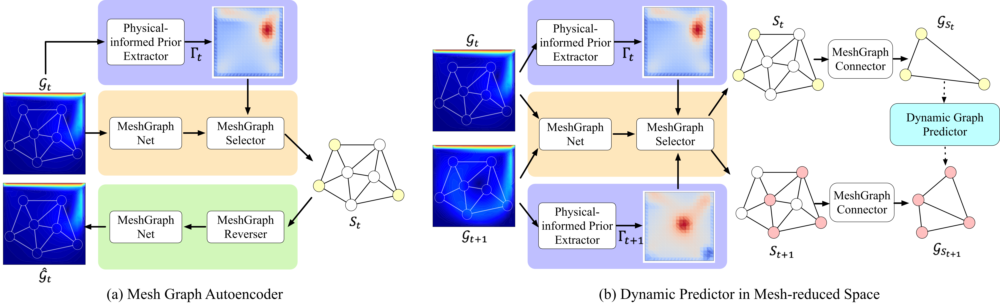
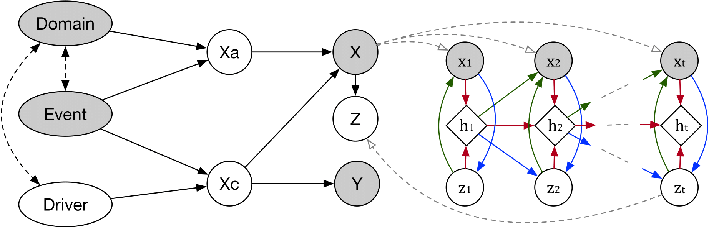
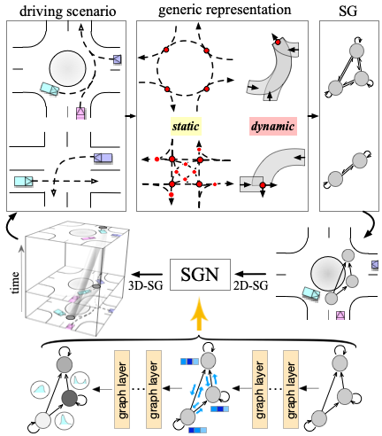
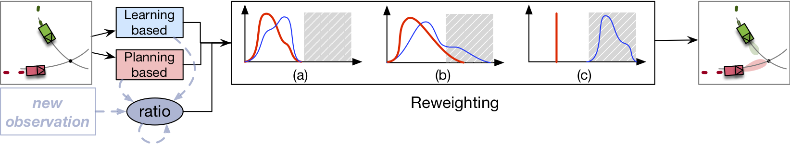
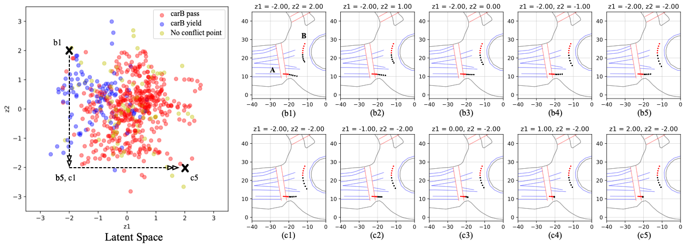
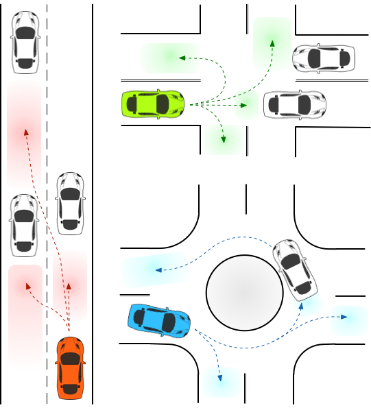
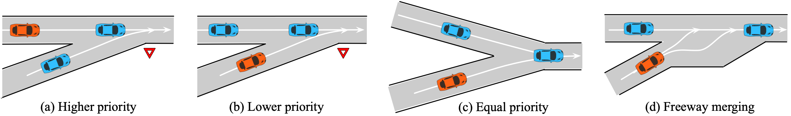

The goal of my research is to create algorithms that are both reliable and efficient, with the desired properties of **adaptability/generalizability**, **interpretability**, **scalability**, and **stability**. These properties are critical for the successful application of algorithms in complex systems. My current focus is on developing and applying these algorithms in two areas: *physics simulations* and *robotics*.

Both physics simulations and robotics have physical systems that are modeled mathematically. However, these domains differ in their primary objectives. Physics simulations aim to comprehend the behavior of physical systems, such as fluids or particles, under varying conditions. In contrast, robotics seeks to develop machines that can carry out tasks autonomously, often requiring interactions with the physical environment and humans. Despite these differences, there is significant overlap in the challenges encountered in both physics simulations and robotics. By designing algorithms that can be applied in both domains, we can gain a deeper understanding of the underlying mathematical principles that govern these systems and develop more efficient and reliable algorithms.

## Physics Simulation

- **Predicting Fluid Dynamics in Physical-informed Mesh-reduced Space** [[paper]](https://openreview.net/pdf?id=EPyS7FHMIK){:target="_blank"}

  

  
For computational fluid dynamics, there is a considerable interest in using neural networks for accelerating simulations. However, these learning-based models suffer from scalability issues when training on high-dimensional and high resolution simulation data generated for real-world applications. In this work, we study the problem of improving accuracy of desired physical properties using graph learning models for learning complex fluid dynamics, while operating on mesh-reduced space. We design several tailored modules to incorporate physicalinformed knowledge into a two-stage prediction model, which directs the learning process to focus more on the region of interest (ROI). Prediction will then be made in a mesh-reduced space, which helps reduce computational costs while preserving important physical properties.

- **Scientific Computing Algorithms to Learn Enhanced Scalable Surrogates for Mesh Physics** [[paper]](https://arxiv.org/pdf/2304.00338.pdf){:target="_blank"}
  
  

  
Data-driven modeling approaches can produce fast surrogates to study large-scale physics problems. Among them, graph neural networks (GNNs) that operate on mesh-based data are desirable because they possess inductive biases that promote physical faithfulness, but hardware limitations have precluded their application to large computational domains. We show that it is possible to train a class of GNN surrogates on 3D meshes with millions of nodes to generate computational fluid dynamics (CFD) simulations. Furthermore, we show how to enhance the surrogate via higher-order numerical integration, which can reduce similation error and training time.

## Behavioral Prediction

- **Causal-based Time Series Domain Generalization** [[paper1]](https://arxiv.org/pdf/2112.02093.pdf){:target="_blank"} [[paper2]](https://ieeexplore.ieee.org/abstract/document/9812188){:target="_blank"} 
  
  

  
Generalization capability to unseen domains is crucial for prediction models when autonomous vehicles are deployed in the real world. In particular, we aim to address the domain generalization problem for vehicle intention prediction tasks and a causal-based time series domain generalization (CTSDG) model is proposed. We construct a structural causal model for vehicle intention prediction tasks to learn an invariant representation of input driving data for domain generalization. We further integrate a recurrent latent variable model into our structural causal model to better capture temporal latent dependencies from time-series input data.

- **Zero-shot Scene-transferable Predictor via Semantic Graph Reasoning** [[paper]](http://arxiv.org/abs/2004.03053){:target="_blank"}[[video]](https://youtu.be/ku_UWa86nYQ){:target="_blank"}

  

  
Since autonomous vehicles need to navigate in dynamically changing environments, they are expected to make
  accurate predictions regardless of where they are and what driving circumstances they encountered. We propose a scenario-transferable and interaction-aware probabilistic prediction algorithm based on semantic graph reasoning, which predicts behaviors of selected agents. We put forward generic representations for various environment information and utilize them as building blocks to construct their spatio-temporal structural relations. We then take the advantage of these structured representations to develop a flexible and transferable prediction algorithm, where the predictor can be directly used under unforeseen driving circumstances that are completely different from training scenarios. 

- **Incorporate Planning-based Method into Prediction:** [[paper]](https://ieeexplore.ieee.org/stamp/stamp.jsp?tp=&arnumber=8917105){:target="_blank"}

  

  
A deep learning model based on conditional variational auto-encoder (CVAE) and an optimal planning framework based on inverse reinforcement learning (IRL) are dynamically combined to predict both irrational and rational behavior of the vehicles. Benefiting from the the HD semantic information, features for the deep learning model were defined in Frenet frame, which generated much better
    prediction performance in terms of generalization. 

- **Explore the Multi-modality and Interpretability of Prediction Problems:** [[paper]](https://ieeexplore.ieee.org/stamp/stamp.jsp?tp=&arnumber=8813796){:target="_blank"}

  

  
As the predicted horizon becomes longer, modeling prediction uncertainties and multi-modal distributions over future sequences will turn into a more challenging task. We addressed this challenge by presenting a multi-modal probabilistic prediction approach. The proposed method is based on a generative model and is capable of jointly predicting sequential motions of each pair of interacting agents. Most importantly, our model is interpretable, which can explain the underneath logic as well as obtain more reliability to use in real applications. A complicate real-world roundabout scenario is utilized to implement and examine the proposed method.

- **Semantic Intention and Motion Prediction:** [[paper1]](https://ieeexplore.ieee.org/stamp/stamp.jsp?arnumber=8500419){:target="_blank"}[[paper2]](https://ieeexplore.ieee.org/stamp/stamp.jsp?arnumber=8569943){:target="_blank"}[[video]](https://youtu.be/6A3Hl-mRhbI){:target="_blank"}

  

  

  
We proposed a Semantic-based Intention and Motion Prediction (SIMP) method, which can be adapted to any driving scenarios by using semantic-defined vehicle behaviors. It utilizes a probabilistic framework based on deep neural network to estimate the intentions, final locations, and the corresponding time information for surrounding vehicles. An exemplar real-world scenario was used to implement and examine the proposed method.
 

## Motion Planning & Decision Making

- **Strategic Decision Making:** [[paper](https://ieeexplore.ieee.org/stamp/stamp.jsp?tp=&arnumber=8968478){:target="_blank"}\]\[[video](https://youtu.be/2CTTFHDW1ec){:target="_blank"}\]

  

  
We proposed an interaction-aware decision making with adaptive strategies (IDAS) approach that can let the autonomous vehicle negotiate the road with other drivers by leveraging their cooperativeness under merging scenarios. A single policy is learned under the multi-agent reinforcement learning (MARL) setting via the curriculum learning strategy, which enables the agent to
    automatically infer other drivers’ various behaviors and make decisions strategically. 

